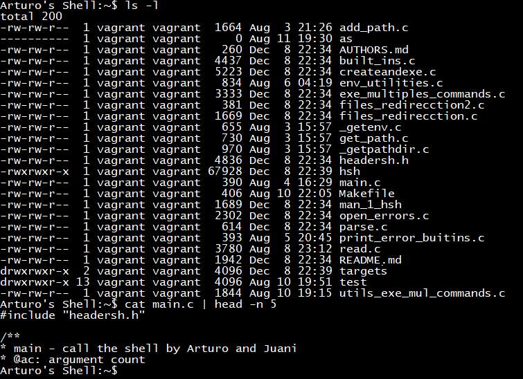

# Shell V2

# 

## Description :book:

**Art SHell** (aka **hsh SHell**) is a homebrewed **sh**-compatible command language interpreter that executes commands read from the standard input or from a file. Everytime a command is executed in the interactive method described above it will print the shell prompt again after execution is finished. Its use is very similar to the *sh* command line interpreter with the exceptions listed below.

## Installation :floppy_disk:

In ubuntu 14.04

- Install gcc and make programs to compile the program

```console
foo@bar:~$ sudo apt install gcc make -y
```

- Go to the shell_v2 folder and built the project with the make command

```console
foo@bar:~/shell_v2$ make hsh
```

## Usage :open_file_folder:

In the "shell_v2" folder uses the next commands:

**Interactive Mode -** To call the shell in its interactive mode it must be called as follows:

```console
foo@bar:~/shell_v2$ ./hsh
```

After this invocation the prompt will be printed and the user will be able to enter command line arguments.

**Non-Interactive Mode -** To call the shell in its non-interactive mode you first call the command and then pipe it to the shell as follows:

```console
foo@bar:~/shell_v2$ [Command] [Command Options] [Arguments] ... | ./hsh
```

After this invocation the shell will exit and return to the terminal that called it.

### Examples:

0. 

```console
foo@bar:~/shell_v2$ ./hsh
($) ls
hsh main.c shell.c
($) exit
foo@bar:~/shell_v2$
```

1. Execute command in interactive mode
```console
foo@bar:~/shell_v2$ cat test_ls_2
/bin/ls
/bin/ls
foo@bar:~/shell_v2$ cat test_ls_2 | ./hsh
hsh main.c shell.c test_ls_2
hsh main.c shell.c test_ls_2
foo@bar:~/shell_v2$
```

2. Execute command in non-interactive mode
```console
foo@bar:~/shell_v2$ ./hsh
($) env
USER=julien
LANGUAGE=en_US
SESSION=ubuntu
COMPIZ_CONFIG_PROFILE=ubuntu
SHLVL=1
HOME=/home/julien
PATH=/home/julien/bin:/home/julien/.local/bin:/usr/local/sbin:/usr/local/bin:/usr/sbin:/usr/bin:/sbin:/bin:/usr/games:/usr/local/games:/snap/bin
DISPLAY=:0
($) exit
foo@bar:~/shell_v2$
```

3. Handle output redirections
```console
foo@bar:~/shell_v2$ ./hsh
($) echo Holberton School >> test
($) cat -e test
Holberton School$
($)
```

4. Handle input redirections
```console
foo@bar:~/shell_v2$ ./hsh
($) rev < small_file
notrebloH
($)
```

5. Handle pipe redirections
```console
foo@bar:~/shell_v2$ ./hsh
($) ls /var | rev
spukcab
ehcac
hsarc
bil
lacol
($)
```

6. Handle AND condition
```console
foo@bar:~/shell_v2$ ./hsh
($) ls /var && ls /var
backups  cache  crash  lib  local  lock  log  mail  metrics  opt  run  spool  tmp
backups  cache  crash  lib  local  lock  log  mail  metrics  opt  run  spool  tmp
($)
```

## Built-ins :minidisc:

The shell has a few built-in functions. These are: **setenv**, **unsetenv**, **exit, env** and **cd.**

## I/O redirections :arrows_clockwise:

The shell has the next I/O redirecctions: <, <<, >, >>, |, &, &&, ||, ;.

## Bugs :bug:

The shell does not handle the following special characters ", ', `, \, *, #.

## Support :email:

LinkedIn:

- [Arturo Victoria Rincon](https://www.linkedin.com/in/arturovictoriar/)
- [Juan Felipe Buitrago Vargas](https://co.linkedin.com/in/juan-felipe-buitrago-vargas-b6b219122)
- [Jhonatan Arenas](https://co.linkedin.com/in/jhonatan-arenas-24473718b)

Twitter:

- [Arturo Victoria Rincon](https://twitter.com/arturovictoriar)
- [Juan Felipe Buitrago](https://twitter.com/juanfe9118)
- [Jhonatan Arenas](https://twitter.com/ookanuki)

Portfolio website:

- [Arturo Victoria Rincon](http://arturovictoriar.github.io/)

## Authors and acknowledgment :school:

Arturo Victoria Rincon is Mechatronics Engineer with innate leadership and adaptability skills. Focused on developing software to improve people's quality of life using tools such as Python, Javascript, C, and C ++.

Jhonatan Arenas is full-stack engineer with 6 months of experience working on software development on both, client and server-side. He is also experienced in functional testing performing and automatizing test cases.

Juan Felipe Buitrago Vargas is a natural born leader who likes to work in team settings, working towards solving problems in an efficient and timely manner. Continuously improving planning skills while learning about Machine Learning and AI.

## License :warning:

:copyright: 2020 All rights reserved.

## Related projects :grey_question:

[simple shell](https://github.com/arturovictoriar/simple_shell)

## Authors :black_nib:

* **Arturo Victoria** [@arturovictoriar](https://github.com/arturovictoriar)
* **Jhonatan Arenas** [@cybernuki](https://github.com/cybernuki)
* **Juan Buitrago** [@juanfe9118](https://github.com/juanfe9118)
